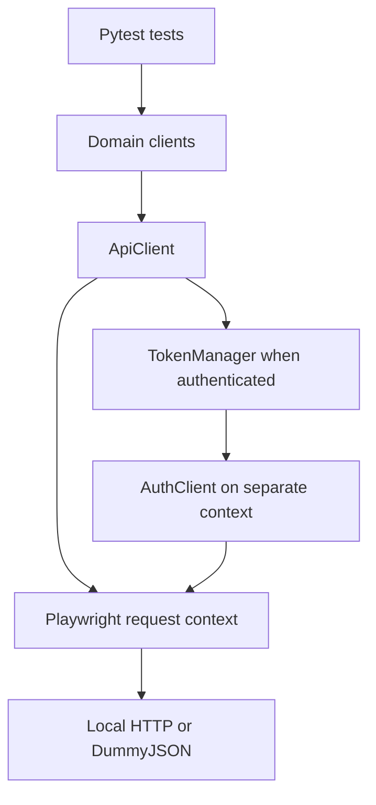

# Playwright Python Enterprise API Framework

**Phase 1: a readable, reusable API automation foundation for an SDET portfolio.**

This project uses **Python + Pytest + Playwright APIRequestContext** to test the
DummyJSON e-commerce API. It starts small: transport, configuration, authentication,
product discovery, users, and carts. Each layer has one responsibility, so adding a
second service later does not require rewriting the HTTP client or test runner.

The word "enterprise" describes the direction of this learning project. Phase 1 is
not a finished production framework. The capability table below separates working
features from the roadmap.

## Start here

1. Follow [Setup](#setup-on-macos-or-linux).
2. Run the deterministic suite: `python -m pytest -m "not external"`.
3. Read [the Phase 1 walkthrough](docs/phase-1-walkthrough.md) while opening the code.
4. Run live DummyJSON checks explicitly when network access is available.

## What Phase 1 implements

| Capability | Implementation |
| --- | --- |
| API transport | A shared `ApiClient` wraps a real Playwright request context |
| Configuration | Validated settings, `.env.example`, environment override precedence |
| Authentication | Login, Bearer header injection, explicit refresh, token invalidation |
| Token caching | One `TokenManager` per test, proactive refresh with a 30-second margin |
| Domain clients | `AuthClient`, `ProductsClient`, `UsersClient`, `CartsClient` |
| Dynamic data | Product IDs from catalogue responses; user IDs from auth/cart responses |
| Data factory | Fresh cart payloads; no mutable shared payloads |
| Assertions | HTTP status, JSON content type, basic shape, and business relationships |
| Isolation | Function-scoped contexts; a separate context for login cookies |
| Diagnostics | Method, endpoint path, status, and elapsed time; no payload/header logging |
| Repeatable checks | Unit tests plus local HTTP checks using the real Playwright driver |
| Public service checks | The same functional scenarios have an opt-in live target |
| CI | Python 3.11/3.12/3.13 quality jobs; manually enabled live job; JUnit artifacts |
| AI-assisted workflow | Repository instructions, testing skill, defect triage/RCA guide |

**Important DummyJSON behavior:** cart additions return simulated results and are
not persisted. Our cart test validates the returned identity and quantities. It
does not claim a database write, a real checkout, or a persistent CRUD lifecycle.
Public product/user/cart endpoints are also not evidence of role-based access control.

## Architecture



The `AuthClient` uses an unauthenticated `ApiClient`. This prevents token acquisition
from recursively trying to acquire a token. Domain methods return `APIResponse`,
so tests can assert an error response as easily as a successful response.

| Location | Responsibility |
| --- | --- |
| `src/api_framework/config.py` | Load and validate settings |
| `src/api_framework/core/api_client.py` | Send GET/POST/general requests; attach auth; log metadata |
| `src/api_framework/core/responses.py` | Basic status and JSON assertions |
| `src/api_framework/auth/token_manager.py` | Cache, refresh, and invalidate tokens |
| `src/api_framework/clients/dummyjson/` | DummyJSON endpoint paths and payload details |
| `src/api_framework/data/cart_factory.py` | Create independent cart payloads |
| `tests/conftest.py` | Create, connect, and dispose fixtures |
| `tests/functional/` | Functional scenarios, each run against local or live targets |
| `tests/unit/` | Token timing, cache behavior, configuration, mutable data isolation |
| `tests/local/` | Real HTTP integration checks for framework behavior |
| `tests/support/local_api.py` | Minimal local test double |
| `.github/workflows/quality.yml` | Quality gates and optional live verification |
| `docs/` | Learning guide, test strategy, test plan, troubleshooting, roadmap |
| `.agents/skills/api-test-strategy/SKILL.md` | Reusable workflow for planning/adding tests |
| `agents/defect-triage.agent.md` | Evidence-driven failure classification and RCA |
| `AGENTS.md` | Repository-wide instructions for coding assistants |

## Setup on macOS or Linux

Use Python **3.11 or newer**. Run these commands from the repository root:

```bash
python3 -m venv .venv
source .venv/bin/activate
python -m pip install --upgrade pip
python -m pip install -r requirements-dev.txt
python -m pip install --no-deps -e .
cp .env.example .env
python -m pytest -m "not external"
```

`-e .` installs the local package in editable mode: edits under `src/` are immediately
available to tests. It avoids custom `sys.path` changes and `PYTHONPATH` workarounds.

`cp .env.example .env` makes a local copy of the documented settings. Keep `.env`
out of Git. The demo credentials in `.env.example` are published by DummyJSON;
replace them only with credentials suitable for the target environment.

**No browser installation is needed for this API-only phase.** The Playwright Python
package includes the driver used by `APIRequestContext`; we do not launch Chromium.
UI automation and browser traces are separate future additions.

Windows PowerShell: create the venv with `py -3 -m venv .venv`, activate with
`.venv\Scripts\Activate.ps1`, and copy the settings with
`Copy-Item .env.example .env`. The `python -m ...` commands remain the same.

## Running tests

| Goal | Command |
| --- | --- |
| Deterministic local suite | `python -m pytest -m "not external"` |
| Default run with live cases shown as skipped | `python -m pytest` |
| Local smoke scenarios | `python -m pytest -m "smoke and not external"` |
| Live DummyJSON only | `python -m pytest -m external --run-external` |
| Live smoke only | `python -m pytest -m "smoke and external" --run-external` |
| Both targets plus framework checks | `python -m pytest --run-external` |
| Cart workflow locally | `python -m pytest -m "workflow and not external"` |
| Framework unit checks only | `python -m pytest tests/unit` |
| Produce a report | `python -m pytest -m "not external" --junitxml=reports/local-results.xml` |
| Lint / formatting | `ruff check .` / `ruff format --check .` |

Functional test names end in `[local]` or `[live]`. A local pass verifies framework
wiring against our test double. A live pass verifies the real service. Neither can
substitute for the other. `--run-external` enables live tests; it does not select only
live tests. Add `-m external` for that selection.

## Phase 1 scenarios

| Scenario | API calls | Main assertion |
| --- | --- | --- |
| Login | `POST /auth/login` | Correct user identity and non-empty access/refresh tokens |
| Authenticated user | Login → `GET /auth/me` | Bearer token resolves to configured user |
| Refresh | Login → me → refresh → me | Refreshed token resolves to the same user |
| Product list | `GET /products` | Valid IDs/titles/prices and bounded page size |
| Dynamic product lookup | List → `GET /products/{id}` | ID/title/price match discovered product |
| Search | List → `GET /products/search` | Discovered product is among results |
| Pagination | Two product list requests | Different product IDs on disjoint one-item pages |
| User lookup | Authenticated me → `GET /users/{id}` | Public user identity matches authenticated identity |
| Existing user carts | List carts → `GET /carts/user/{userId}` | Returned carts belong to discovered owner |
| Current user carts | Authenticated me → user carts | Every returned cart belongs to that user; empty is valid |
| Simulated cart creation | Me + product discovery → `POST /carts/add` | Correct owner, product ID, and quantity in response |

The test plan records priorities and expected behavior in
[docs/test-plan.md](docs/test-plan.md). Data prerequisites such as "at least two
products" are explicit; the suite never fixes the catalogue size or a public ID.

## Authentication decisions

- `TokenManager` receives a `TokenSource` protocol, so a future service can provide
  its own login/refresh implementation without changing the cache.
- The cache is in memory and scoped to one test. There is no global token or shared
  token file. Login cookies live in a separate request context.
- Refresh is scheduled using the duration requested from DummyJSON and a monotonic
  clock. This is a scheduling assumption, not cryptographic JWT validation.
- A failed refresh clears the old cache and surfaces the failure. A later explicit
  request can acquire a fresh login; the failed call is not silently retried.
- There is no automatic 401 retry or replay of a business request. HTTP responses,
  including 4xx/5xx/429, remain available to assertions.
- Playwright redirects and transport retries are disabled in the wrapper. This
  makes failures visible and avoids accidentally forwarding auth to another origin.
- The manager is synchronous and not thread-safe. Later worker/process parallelism
  will require a separate manager and context per worker/test.

## Test strategy and CI

Use the [testing strategy](docs/testing-strategy.md) for the test pyramid, risks,
data isolation, and quality gates. For this phase, the broad base is framework unit
checks, followed by local HTTP integration checks. A smaller live suite confirms
real e-commerce API behavior. This repository has no UI tests yet.

The workflow runs lint, formatting, and local tests on pushes to `main` and pull
requests. A failure blocks that job. To run live tests in GitHub Actions, choose
**Actions → API framework quality → Run workflow → Run the live DummyJSON suite**.
The live job runs after quality succeeds, uses Python 3.12, and remains a separate
signal from the deterministic checks. Workflow configuration alone does not enable
branch protection; the repository owner must configure required checks if desired.

Reports are JUnit XML files under `reports/`, ignored by Git, and uploaded as CI
artifacts for seven days. Logged timings are diagnostic; they are not performance
benchmarks or response-time SLAs. Do not use `--showlocals` or dump raw auth bodies
into shared reports.

`requirements-dev.txt` pins the resolved development dependencies. `pyproject.toml`
states compatible dependency ranges. To update the pins deliberately with `uv`:

```bash
uv pip compile pyproject.toml --extra dev -o requirements-dev.txt
python -m pip install -r requirements-dev.txt
ruff check .
python -m pytest -m "not external"
```

## AI-assisted testing

Read `AGENTS.md` before using a coding assistant. It links to the repository testing
skill and the defect triage agent guide. These Markdown files provide instructions;
they do not launch an autonomous agent or require an LLM API key.

Example task:

> Read AGENTS.md and use .agents/skills/api-test-strategy/SKILL.md to plan a product
> filter test. Explain the risk and expected behavior first, then add the smallest
> client method and test. Use dynamic data and run the relevant checks.

For failures, ask the assistant to read `agents/defect-triage.agent.md` and return a
redacted defect report using `docs/templates/defect-report.md`. Verify generated
code and conclusions yourself. Never label an inferred cause as a confirmed RCA.

## Learning and contribution

Read [the walkthrough](docs/phase-1-walkthrough.md) for the recommended file order,
fixture explanation, practice tasks, and interview explanation. See
[tests/README.md](tests/README.md) for selection and test-double limitations,
[src/README.md](src/README.md) for extending a service adapter, and
[troubleshooting](docs/troubleshooting.md) for common setup/failure cases.

Keep changes small: one endpoint, one behavior, one focused commit. Add only the
abstraction the next test needs. Do not add empty provider classes or folders for
future services.

## Roadmap

| Phase | Planned capability | Status |
| --- | --- | --- |
| 1 | Core transport, DummyJSON auth/products/users/carts, CI, learning docs | Implemented |
| 2 | JSON Schema/Pydantic, contract checks, negative and boundary tests | Planned |
| 3 | Restful Booker persistent booking create/read/update/patch/delete lifecycle | Planned |
| 4 | ReqRes adapter; verify current API-key, persistence, and plan requirements first | Planned |
| 5 | Owned FastAPI app, JWT, PostgreSQL, Mailpit, MFA, file workflows | Planned |
| Later | Local security/failure injection, Schemathesis/Hypothesis, Docker, richer reporting | Planned |

See [docs/roadmap.md](docs/roadmap.md) for acceptance criteria. Security fuzzing,
load testing, rate-limit stress, and cross-user access checks belong in an owned
local environment. Phase 1 does not implement those capabilities.

## Validation and sources

[Validation notes](docs/validation.md) distinguish executed local checks from
unverified live-service behavior. Official references used for this phase:

- [Playwright Python API testing](https://playwright.dev/python/docs/api-testing)
- [APIRequestContext reference](https://playwright.dev/python/docs/api/class-apirequestcontext)
- [Pytest fixtures](https://docs.pytest.org/en/stable/how-to/fixtures.html)
- [DummyJSON auth](https://dummyjson.com/docs/auth)
- [DummyJSON products](https://dummyjson.com/docs/products)
- [DummyJSON users](https://dummyjson.com/docs/users)
- [DummyJSON carts](https://dummyjson.com/docs/carts)

**Portfolio explanation:** "I built a layered Python API automation foundation using
Playwright and Pytest. It separates HTTP transport, service clients, token handling,
fixtures, and assertions. Phase 1 covers DummyJSON e-commerce APIs with dynamic data,
isolated authentication, repeatable local checks, and optional live verification."
