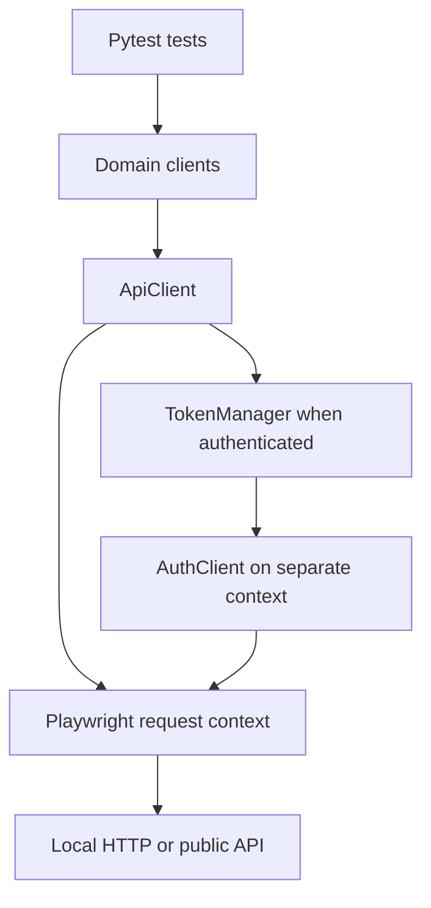

# Playwright Python Enterprise API Framework

**Phase 4: one API framework across Bearer tokens, cookie sessions, and project API keys.**

This project uses **Python + Pytest + Playwright APIRequestContext** to test the
DummyJSON e-commerce API, Restful Booker booking API, and ReqRes. Shared transport,
configuration rules, and response validation support separate service adapters.
DummyJSON covers discovery and simulated carts; Booker adds persistent CRUD within
the lifetime of its shared demo dataset. ReqRes adds public fixture scenarios and
an API-key-authenticated persistent project adapter. Project live verification
requires your own manage key; see the validation record for executed outcomes.

The word "enterprise" describes the direction of this learning project. This is
not a finished production framework. The capability table below separates working
features from the roadmap.

## Start here

1. Follow [Setup](#setup-on-macos-or-linux).
2. Run the deterministic suite: `python -m pytest -m "not external"`.
3. Read [the Phase 1 walkthrough](docs/phase-1-walkthrough.md) while opening the code.
4. Continue with [the Phase 2 walkthrough](docs/phase-2-walkthrough.md) for contracts and negative testing.
5. Follow [the Phase 3 walkthrough](docs/phase-3-walkthrough.md) for booking lifecycle and cleanup.
6. Read [the Phase 4 walkthrough](docs/phase-4-walkthrough.md) for API keys, project data, and quotas.
7. Run selected live suites explicitly; configure your own key before ReqRes project tests.

## What is implemented

| Capability | Implementation |
| --- | --- |
| API transport | A shared `ApiClient` wraps a real Playwright request context |
| Configuration | Validated settings, `.env.example`, environment override precedence |
| Authentication | Login, Bearer header injection, explicit refresh, token invalidation |
| Token caching | One `TokenManager` per test, proactive refresh with a 30-second margin |
| Domain clients | DummyJSON auth/products/users/carts, Booker auth/bookings, ReqRes demo users/project records |
| Persistent lifecycle | Booker CRUD/PATCH; ReqRes project create/read/PUT/delete with separate GET checks |
| Booker authentication | Per-test token cookie attached only by the Booker mutation client; separate login context |
| ReqRes authentication | Per-request x-api-key; explicit project/env; no invented login or refresh |
| Cleanup | Register created IDs before schema assertions; verify owner marker; delete and confirm absence; report failures |
| Dynamic data | Product IDs from catalogue responses; user IDs from auth/cart responses |
| Data factories | Fresh carts and synthetic bookings with unique markers and validated date order |
| Response contracts | Packaged Draft 2020-12 contracts for all three services; reviewed ReqRes OpenAPI excerpt |
| Typed validation | Strict Pydantic product views and cart input models; no numeric-string coercion |
| Assertions | HTTP status, exact JSON media type, schema structure, and business relationships |
| Negative coverage | Missing/invalid credentials and tokens, invalid IDs, malformed cart lists, unsupported method |
| Boundaries | One-item pages, zero limit, exhausted pagination, empty search, quantities and monetary totals |
| Isolation | Function-scoped contexts; a separate context for login cookies |
| Diagnostics | Method, endpoint path, status, and elapsed time; no payload/header logging |
| Repeatable checks | Unit tests plus local HTTP checks using the real Playwright driver |
| Public service checks | The same functional scenarios have an opt-in live target |
| Rate-limit behavior | Return 429 and Retry-After unchanged; loopback checks prove no automatic replay |
| CI | Python 3.11/3.12/3.13 quality; independent DummyJSON, Booker, ReqRes demo/project live jobs |
| AI-assisted workflow | Repository instructions, testing skill, defect triage/RCA guide |

**Important DummyJSON behavior:** cart additions return simulated results and are
not persisted. Our cart test validates the returned identity and quantities. It
does not claim a database write, a real checkout, or a persistent CRUD lifecycle.
Public product/user/cart endpoints are also not evidence of role-based access control.

## Architecture



The `AuthClient` uses an unauthenticated `ApiClient`. This prevents token acquisition
from recursively trying to acquire a token. Domain methods return `APIResponse`,
so tests can assert an error response as easily as a successful response. The
TokenManager branch above applies to DummyJSON. Booker has no refresh endpoint;
its adapter sends `Cookie: token=...` for PUT/PATCH/DELETE and reuses the same core
transport without pretending that cookie authentication is a Bearer-token lifecycle.

| Location | Responsibility |
| --- | --- |
| `src/api_framework/config.py` | Load and validate settings |
| `src/api_framework/core/api_client.py` | Send GET/POST/general requests; attach auth; log metadata |
| `src/api_framework/core/responses.py` | Status, JSON media type, and object assertions |
| `src/api_framework/contracts/` | Checked-in schemas, safe contract diagnostics, strict Pydantic models |
| `src/api_framework/auth/token_manager.py` | Cache, refresh, and invalidate tokens |
| `src/api_framework/clients/dummyjson/` | DummyJSON endpoint paths and payload details |
| `src/api_framework/clients/restful_booker/` | Booker login/session and booking CRUD methods |
| `src/api_framework/clients/reqres/` | Demo users, API-key header policy, project records |
| `src/api_framework/data/record_factory.py` | Strict starter product data with synthetic name markers |
| `tests/reqres/` | Separate demo and project fixtures/scenarios |
| `tests/support/record_lifecycle.py` | Owned record tracking and visible cleanup |
| `tests/support/local_reqres.py` | Small fixture/persistent loopback model |
| `src/api_framework/data/booking_factory.py` | Strict synthetic booking payloads and ISO date serialization |
| `tests/booker/conftest.py` | Independent targets, contexts, auth, and lifecycle tracker fixture |
| `tests/booker/test_bookings.py` | Persistent workflow, filtering, PATCH boundaries, auth rejection |
| `tests/support/booking_lifecycle.py` | Test-owned resource tracking and visible cleanup |
| `tests/support/local_booker.py` | Small persistent loopback HTTP model |
| `src/api_framework/data/cart_factory.py` | Create independent cart payloads |
| `tests/conftest.py` | Create, connect, and dispose fixtures |
| `tests/functional/` | Functional scenarios, each run against local or live targets |
| `tests/unit/` | Token policy, config, validator fault injection, model policy, JSON envelope checks |
| `tests/contracts/` | Typed product parsing and refresh response contract |
| `tests/negative/` | Rejected requests using isolated anonymous contexts |
| `tests/boundary/` | Pagination/empty collections and simulated cart arithmetic |
| `tests/local/` | Real HTTP integration checks for framework behavior |
| `tests/support/local_api.py` | Minimal local test double |
| `.github/workflows/quality.yml` | Quality gates and optional live verification |
| `docs/` | Learning guide, test strategy, test plan, troubleshooting, roadmap |
| `.agents/skills/api-test-strategy/SKILL.md` | Reusable workflow for planning/adding tests |
| `agents/defect-triage.agent.md` | Evidence-driven failure classification and RCA |
| `AGENTS.md` | Repository-wide instructions for coding assistants |

## Setup on macOS or Linux

Use Python **3.11 or newer**. Run these commands from the repository root:

```bash
python3 -m venv .venv
source .venv/bin/activate
python -m pip install --upgrade pip
python -m pip install -r requirements-dev.txt
python -m pip install --no-deps -e .
cp .env.example .env
python -m pytest -m "not external"
```

`-e .` installs the local package in editable mode: edits under `src/` are immediately
available to tests. It avoids custom `sys.path` changes and `PYTHONPATH` workarounds.

`cp .env.example .env` makes a local copy of the documented settings. Keep `.env`
out of Git. The demo credentials in `.env.example` are published by the two demo providers;
replace them only with credentials suitable for the target environment.

**No browser installation is needed for this API-only phase.** The Playwright Python
package includes the driver used by `APIRequestContext`; we do not launch Chromium.
UI automation and browser traces are separate future additions.

Windows PowerShell: create the venv with `py -3 -m venv .venv`, activate with
`.venv\Scripts\Activate.ps1`, and copy the settings with
`Copy-Item .env.example .env`. The `python -m ...` commands remain the same.

## Running tests

| Goal | Command |
| --- | --- |
| Deterministic local suite | `python -m pytest -m "not external"` |
| Default run with live cases shown as skipped | `python -m pytest` |
| Local smoke scenarios | `python -m pytest -m "smoke and not external"` |
| Local contract checks | `python -m pytest -m "contract and not external"` |
| Local rejected requests | `python -m pytest -m "negative and not external"` |
| Local boundary checks | `python -m pytest -m "boundary and not external"` |
| Live DummyJSON only | `python -m pytest -m "external and not booker and not reqres" --run-external` |
| Local Booker only | `python -m pytest -m "booker and not external"` |
| Live Booker only | `python -m pytest -m "booker and external" --run-external` |
| Local ReqRes | `python -m pytest -m "reqres and not external"` |
| Live ReqRes demo | `python -m pytest -m "reqres_demo and external" --run-external` |
| Live ReqRes project (configured key) | `python -m pytest -m "reqres_project and external" --run-external` |
| All live services (configured key) | `python -m pytest -m external --run-external` |
| Cleanup fault injection | `python -m pytest tests/local/test_booking_cleanup.py` |
| Live smoke only | `python -m pytest -m "smoke and external" --run-external` |
| Both targets plus framework checks | `python -m pytest --run-external` |
| Workflows locally | `python -m pytest -m "workflow and not external"` |
| Framework unit checks only | `python -m pytest tests/unit` |
| Produce a report | `python -m pytest -m "not external" --junitxml=reports/local-results.xml` |
| Lint / formatting | `ruff check .` / `ruff format --check .` |

Functional test names end in `[local]` or `[live]`. A local pass verifies framework
wiring against our test double. A live pass verifies the real service. Neither can
substitute for the other. `--run-external` enables live tests; it does not select only
live tests. Add `-m external` for that selection.

## Phase 1 scenarios

| Scenario | API calls | Main assertion |
| --- | --- | --- |
| Login | `POST /auth/login` | Correct user identity and non-empty access/refresh tokens |
| Authenticated user | Login → `GET /auth/me` | Bearer token resolves to configured user |
| Refresh | Login → me → refresh → me | Refreshed token resolves to the same user |
| Product list | `GET /products` | Valid IDs/titles/prices and bounded page size |
| Dynamic product lookup | List → `GET /products/{id}` | ID/title/price match discovered product |
| Search | List → `GET /products/search` | Discovered product is among results |
| Pagination | Two product list requests | Different product IDs on disjoint one-item pages |
| User lookup | Authenticated me → `GET /users/{id}` | Public user identity matches authenticated identity |
| Existing user carts | List carts → `GET /carts/user/{userId}` | Returned carts belong to discovered owner |
| Current user carts | Authenticated me → user carts | Every returned cart belongs to that user; empty is valid |
| Simulated cart creation | Me + product discovery → `POST /carts/add` | Correct owner, product ID, and quantity in response |

The test plan records priorities and expected behavior in
[docs/test-plan.md](docs/test-plan.md). Data prerequisites such as "at least two
products" are explicit; the suite never fixes the catalogue size or a public ID.

## Phase 2: contracts and rejection behavior

Existing functional scenarios now call `contract_json(response, "product_page")`
or the appropriate named contract before checking business relationships.
`contract_json` checks the status, `application/json` media type, JSON object, and
schema in that order. Clients still return raw `APIResponse` objects.

JSON Schema is the response compatibility contract: required fields, nested types,
and numeric ranges. Unknown response fields remain compatible, avoiding brittle
full snapshots. Pydantic provides a strict typed product view for downstream use
and validates generated cart requests. These are partial project contracts, not a
complete OpenAPI specification or a provider-owned contract-testing system.

Our cart factory requires positive integer IDs/quantities and nonempty items.
DummyJSON accepts some inputs more permissively; factory validation does not prove
that the server rejects those inputs. Negative API tests deliberately bypass the
valid factory with raw dictionaries and assert verified service behavior.

| Phase 2 coverage | Expected behavior |
| --- | --- |
| Missing username/password; wrong password | 400 with a JSON error message |
| Missing or malformed access token | 401 on `/auth/me`, with no login cookies |
| Missing / invalid refresh token | 401 / 403 respectively |
| Zero or malformed product identifier | 404 JSON error |
| `POST /products` | 404; an unmatched route need not have a JSON body |
| Empty / non-array cart product list; missing user | 400 JSON error |
| `limit=1`, `skip=0` | One product at the first offset |
| `skip` at discovered catalogue total | Empty page with total retained |
| `limit=0` | All products, as documented by DummyJSON |
| Unmatched search | Valid empty collection |
| Cart quantity 1 or 3 | Owner/product match; totals agree with price × quantity |

Contract failures report a schema location and rule without response values.
Pydantic models hide invalid inputs in their displayed validation errors. These
protections do not make `--showlocals`, raw exceptions, or body dumps safe to share.
See [contract maintenance](docs/contracts.md) and the
[Phase 2 test plan](docs/phase-2-test-plan.md) for the rationale and scope.

## Phase 3: persistent booking lifecycle

Restful Booker is the second service adapter. It reuses `ApiClient` and the contract
validator with `service="restful_booker"`, while keeping its config, cookie session,
fixtures, and resource lifecycle independent from DummyJSON.

| Operation / case | Expected behavior |
| --- | --- |
| `GET /ping` | 201; a status response rather than a JSON object |
| Valid `POST /auth` | 200 with token; no refresh mechanism |
| Invalid credentials | 200 with `reason: Bad credentials`; absence of token |
| `POST /booking` | 200 with a returned booking ID and booking object |
| `GET /booking/{created_id}` | 200; persisted fields match the synthetic input |
| Filter by created firstname/unique lastname | 200 array; contains our returned ID |
| Authenticated PUT | 200; replacement fields persist on a separate GET |
| Authenticated PATCH | 200; changed fields persist and untouched fields remain |
| PATCH `totalprice=0`, `depositpaid=false` | Values persist without truthiness mistakes |
| Anonymous PUT/PATCH/DELETE or invalid-cookie PATCH | 403; our booking remains unchanged |
| Authenticated DELETE | 201; later GET returns 404 |

The `booking_tracker` fixture authenticates before creating data. `create()` records
a usable response ID **before** status/schema assertions, then teardown runs before
request contexts close. Each booking has a synthetic `QA-<UUID>` lastname marker.
Cleanup reads the tracked ID, checks that marker, deletes it, and verifies 404.
Already-absent IDs are accepted in teardown; changed markers stop deletion and fail
cleanup. Cleanup tries every tracked ID and reports failures without retries.

The shared demo resets periodically and other users can write to it. Marker checks
reduce ID-reuse risk; they cannot make GET-then-DELETE atomic. Never mutate seed
bookings, infer tenant isolation, or claim permanent durability. If creation does
not return a usable ID, cleanup cannot safely infer which resource was created.
Only synthetic data is sent. The live suite creates seven small bookings per run.

Read [the Phase 3 test plan](docs/phase-3-test-plan.md) and
[walkthrough](docs/phase-3-walkthrough.md) for fixture ordering, cleanup failures,
source-backed status conventions, practice exercises, and interview explanations.

## Phase 4: ReqRes demo and project records

ReqRes's public demo has fixture users and simulated creates. Its project API stores
records behind `x-api-key`; these are separate clients, fixtures, tests, and CI jobs.
The current LLM reference describes keyless demo access, while older docs/OpenAPI
still declare keys on demo endpoints. Live results must resolve that discrepancy
for the execution environment. No tutorial key is treated as a project credential.

The project adapter wraps POST/PUT input as `{"data": {...}}`, includes `project_id`
and `X-Reqres-Env`, and verifies persisted fields on a separate GET. Tests use the
starter Products fields with unique `QA-<UUID>` names. Track IDs before assertions;
preserve that marker in updates; verify ownership before DELETE and GET 404 after it.
DELETE expects 204 and an empty body. A malformed negative create's unexpected
success is also tracked for cleanup. No seed data or collection definitions are changed.

Configure a dedicated QA project's manage key in ignored `.env` as `REQRES_API_KEY`,
plus `REQRES_PROJECT_ID`; collection/env default to products/prod. For Actions,
store the key as a repository Secret and the project ID as a repository Variable.
[The walkthrough](docs/phase-4-walkthrough.md) gives the exact setup and commands.
Missing project credentials fail before HTTP, not as a claimed live pass.

The reviewed reference advertises a Free limit of 250 requests/day and 100 records;
confirm your actual account entitlements. The project suite normally sends fifteen
requests and creates two small records. Local injection checks show 429 and
Retry-After remain visible without replay; public quota exhaustion is not tested.
Record deletion may be soft: default API absence is not proof of database erasure
or quota reclamation. Project PATCH, public-key permissions, app-user sessions,
and full OpenAPI/provider verification remain outside this phase.

Read [the Phase 4 plan](docs/phase-4-test-plan.md) for provider discrepancies,
scenario mapping, cleanup limits, and point-in-time evidence.

## Authentication decisions

- `TokenManager` receives a `TokenSource` protocol, so a future service can provide
  its own login/refresh implementation without changing the cache.
- The cache is in memory and scoped to one test. There is no global token or shared
  token file. Login cookies live in a separate request context.
- Refresh is scheduled using the duration requested from DummyJSON and a monotonic
  clock. This is a scheduling assumption, not cryptographic JWT validation.
- A failed refresh clears the old cache and surfaces the failure. A later explicit
  request can acquire a fresh login; the failed call is not silently retried.
- There is no automatic 401 retry or replay of a business request. HTTP responses,
  including 4xx/5xx/429, remain available to assertions.
- Playwright redirects and transport retries are disabled in the wrapper. This
  makes failures visible and avoids accidentally forwarding auth to another origin.
- The manager is synchronous and not thread-safe. Later worker/process parallelism
  will require a separate manager and context per worker/test.

## Test strategy and CI

Use the [testing strategy](docs/testing-strategy.md) for the test pyramid, risks,
data isolation, and quality gates. For this phase, the broad base is framework unit
checks, including deliberately invalid contracts/models, followed by local HTTP integration checks.
A smaller live suite confirms
real behavior of each public API. This repository has no UI tests yet.

The workflow runs lint, formatting, distribution builds, and local tests on pushes to `main` and pull
requests. A failure blocks that job. To run live tests in GitHub Actions, choose
**Actions → API framework quality → Run workflow** and enable the desired service
checkboxes. ReqRes project execution needs the configured Secret/Variables.
Each live job runs after quality succeeds, uses Python 3.12, and remains a separate
signal from the deterministic checks. Workflow configuration alone does not enable
branch protection; the repository owner must configure required checks if desired.

Reports are JUnit XML files under `reports/`, ignored by Git, and uploaded as CI
artifacts for seven days. Logged timings are diagnostic; they are not performance
benchmarks or response-time SLAs. Do not use `--showlocals` or dump raw auth bodies
into shared reports.

`requirements-dev.txt` pins the resolved development dependencies. `pyproject.toml`
states compatible dependency ranges. To update the pins deliberately with `uv`:

```bash
uv pip compile pyproject.toml --extra dev -o requirements-dev.txt
python -m pip install -r requirements-dev.txt
ruff check .
python -m pytest -m "not external"
```

## AI-assisted testing

Read `AGENTS.md` before using a coding assistant. It links to the repository testing
skill and the defect triage agent guide. These Markdown files provide instructions;
they do not launch an autonomous agent or require an LLM API key.

Example task:

> Read AGENTS.md and use .agents/skills/api-test-strategy/SKILL.md to plan a product
> filter test. Explain the risk and expected behavior first, then add the smallest
> client method and test. Use dynamic data and run the relevant checks.

For failures, ask the assistant to read `agents/defect-triage.agent.md` and return a
redacted defect report using `docs/templates/defect-report.md`. Verify generated
code and conclusions yourself. Never label an inferred cause as a confirmed RCA.

## Learning and contribution

Read [the walkthrough](docs/phase-1-walkthrough.md) for the recommended file order,
fixture explanation, practice tasks, and interview explanation. See
[tests/README.md](tests/README.md) for selection and test-double limitations,
[src/README.md](src/README.md) for extending a service adapter, and
[troubleshooting](docs/troubleshooting.md) for common setup/failure cases.

Keep changes small: one endpoint, one behavior, one focused commit. Add only the
abstraction the next test needs. Do not add empty provider classes or folders for
future services.

## Roadmap

| Phase | Planned capability | Status |
| --- | --- | --- |
| 1 | Core transport, DummyJSON auth/products/users/carts, CI, learning docs | Implemented |
| 2 | JSON Schema/Pydantic, contract checks, negative and boundary tests | Implemented |
| 3 | Restful Booker persistent booking create/read/update/patch/delete lifecycle | Implemented |
| 4 | ReqRes demo/project adapter, API keys, contracts, owned records, 429 checks | Implemented; project live compatibility needs your key |
| 5 | Owned FastAPI app, JWT, PostgreSQL, Mailpit, MFA, file workflows | Planned |
| Later | Local security/failure injection, Schemathesis/Hypothesis, Docker, richer reporting | Planned |

See [docs/roadmap.md](docs/roadmap.md) for acceptance criteria. Security fuzzing,
load testing, rate-limit stress, and cross-user access checks belong in an owned
local environment. Those capabilities remain future work.

## Validation and sources

[Validation notes](docs/validation.md) retain each phase's separate evidence.
Phase 4 has **203 passing deterministic tests** and **51 live-capable cases**:
32 DummyJSON, 10 Booker, 4 ReqRes demo, and 5 ReqRes project. Collection alone is
not live compatibility. See the record for CI/live outcomes and pending configuration.
Official references used for this phase:

- [Playwright Python API testing](https://playwright.dev/python/docs/api-testing)
- [APIRequestContext reference](https://playwright.dev/python/docs/api/class-apirequestcontext)
- [Pytest fixtures](https://docs.pytest.org/en/stable/how-to/fixtures.html)
- [DummyJSON auth](https://dummyjson.com/docs/auth)
- [DummyJSON products](https://dummyjson.com/docs/products)
- [DummyJSON users](https://dummyjson.com/docs/users)
- [DummyJSON carts](https://dummyjson.com/docs/carts)
- [jsonschema validation](https://python-jsonschema.readthedocs.io/en/stable/validate/)
- [Pydantic strict mode](https://docs.pydantic.dev/latest/concepts/strict_mode/)
- [Phase 2 contract basis and maintenance policy](docs/contracts.md)
- [Restful Booker API documentation](https://restful-booker.herokuapp.com/apidoc/index.html)
- [Phase 3 provider basis and cleanup policy](docs/phase-3-test-plan.md)
- [ReqRes current API reference](https://reqres.in/llm.txt)
- [ReqRes OpenAPI](https://reqres.in/openapi.json)
- [Phase 4 basis, limits, and test plan](docs/phase-4-test-plan.md)

**Portfolio explanation:** "I built a layered Python API automation foundation using
Playwright and Pytest. It separates HTTP transport, service clients, token handling,
fixtures, and assertions. Phase 1 covers DummyJSON e-commerce APIs with dynamic data,
isolated authentication, repeatable local checks, and optional live verification.
Phase 2 adds partial JSON Schema response contracts, strict Pydantic models, and
negative/boundary cases while distinguishing framework policy from provider behavior.
Phase 3 reuses the core for a second auth style and persistent booking lifecycle,
with owned-resource tracking and tested cleanup after failures. Phase 4 adds
API-key project records and distinguishes demo simulation, local wiring, and
account-specific live evidence."
