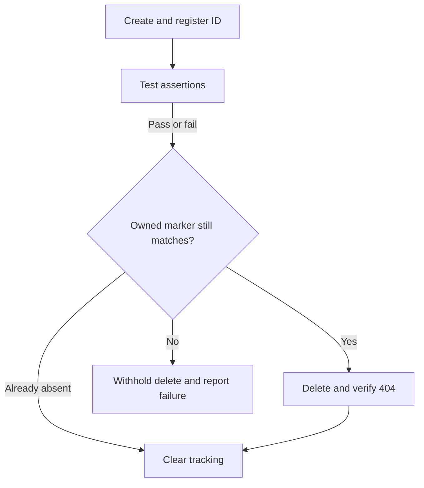

# Phase 3: persistent booking test plan

## Goal and boundaries

Demonstrate a second service/auth style using the same Playwright transport and
response-contract engine. Verify persistent create/read/PUT/PATCH/delete behavior
within Restful Booker's shared dataset lifetime, and prove that test failures do
not bypass owned-resource cleanup.

The suite does not use seed IDs, modify other users' records, claim permanent storage,
validate a real database, or implement tenant isolation. Its ten service cases run
locally and live. Seven cases create one small synthetic booking each; every returned
usable ID is tracked for teardown. No brute force, load loops, or broad fuzzing.

## Provider basis (reviewed 2026-10-04)

Use the [official API docs](https://restful-booker.herokuapp.com/apidoc/index.html),
[official service page](https://restful-booker.herokuapp.com/), and provider source
at commit `00461155995c8636866bf51dc444f63033da44fb`:

- [Routes and embedded endpoint docs](https://github.com/mwinteringham/restful-booker/blob/00461155995c8636866bf51dc444f63033da44fb/routes/index.js).
- [Generated API documentation data](https://github.com/mwinteringham/restful-booker/blob/00461155995c8636866bf51dc444f63033da44fb/public/apidoc/api_data.json).
- [Booking storage implementation](https://github.com/mwinteringham/restful-booker/blob/00461155995c8636866bf51dc444f63033da44fb/models/booking.js).

Source inspection establishes expectations; live execution confirms deployed behavior.
Booker deliberately contains testing quirks: bad credentials produce 200 with a
reason, create returns 200, delete/ping return 201, and anonymous writes return 403.
Successful deletion has a status body, and missing GET is 404; do not impose a JSON
error contract on either. The source returns 405 for authenticated deletion of a
missing ID. This is accepted in teardown only if a separate GET proves absence.

The official landing page advertises a reset every ten minutes. The shared service
can reset or receive competing writes; tests must report these failures honestly.
Cookie tokens have no refresh endpoint. Basic auth is a documented alternative,
but this adapter implements cookie auth only and claims no Basic-auth coverage.

## Service scenarios

| ID / priority | Test | Method/path and data | Expected behavior | Marker |
| --- | --- | --- | --- | --- |
| RB-01 / P0 | `test_booker_health` | GET /ping | 201 status | smoke |
| RB-02 / P0 | `test_booker_login_contract` | POST /auth, configured demo credentials | 200; nonempty token string | smoke, contract |
| RB-03 / P1 | `test_booker_bad_credentials_return_reason` | POST /auth, wrong demo password | 200; Bad credentials reason; no token | negative |
| RB-04 / P0 | `test_complete_booking_lifecycle` | Create synthetic booking → GET → PUT → GET → PATCH → GET → DELETE → GET | 200 shapes/fields persist; PATCH preserves untouched fields; 201 delete; 404 absence | workflow, contract |
| RB-05 / P1 | `test_created_booking_is_discoverable_by_its_unique_name` | Create → GET /booking with exact generated firstname/lastname → detail GET | 200 ID array contains our returned ID; detail matches input | regression, contract |
| RB-06 / P1 | `test_patch_persists_false_and_zero_without_changing_other_fields` | Owned ID; PATCH depositpaid false and totalprice 0 → GET | Both values persist; other fields match original | boundary, contract |
| RB-07 / P0 | `test_anonymous_writes_are_rejected_and_booking_is_unchanged` (3) | Owned ID; PUT/PATCH/DELETE via clean public context | 403; follow-up GET still matches original | negative |
| RB-08 / P0 | `test_invalid_cookie_cannot_update_owned_booking` | Owned ID; PATCH with harmless invalid cookie | 403; follow-up GET unchanged | negative |

All cases carry `booker`. Fixture-generated live versions also carry `external`.
Booker uses separate target fixtures; its cases do not multiply with DummyJSON targets.
Valid mutation data is generated per test. No exact global booking count is asserted.

## Cleanup policy

1. Authenticate the cleanup client before the first create.
2. Generate a `QA-<UUID>` lastname; retain it through all PUT/PATCH operations.
3. Parse creation JSON and register any positive integer booking ID before checking
   HTTP status, complete schema, or business fields.
4. Run teardown before dependent request contexts are disposed.
5. GET each tracked ID: 404 means already absent. For 200, validate the JSON envelope
   and compare the marker independently of unrelated booking schema rules.
6. If the marker changed, withhold deletion and fail cleanup. If it matches, DELETE
   and verify GET 404. Do not convert 403/5xx into a pass.
7. Attempt remaining IDs even after one fails, retain failed tracking, and report a
   redacted aggregate error. Do not replay automatically.



Marker checks reduce accidental cleanup of reused IDs, but the public API provides
no atomic conditional delete. A reset/change between ownership GET and DELETE is
still possible. An owned application with stronger resource IDs/version conditions
is the future solution. Do not claim this demo proves production-grade isolation.

If creation succeeds remotely but returns unusable JSON or no ID, the framework
cannot identify the booking safely. It fails explicitly rather than searching and
deleting by guessed IDs. Abrupt process termination can also prevent teardown.
Ordinary test/contract failures are covered; cleanup success is not guaranteed
when the network, authentication, or service itself fails.

## Cheaper-layer verification

| Layer | Risk checked |
| --- | --- |
| Unit | Independent payloads/markers; real date order; strict price/stay types; hidden secrets; cookie injection prevention; config precedence/origin checks; contract service selection and nested fields |
| Local HTTP | Cleanup after assertion failure; ID tracked before malformed response validation; continue other IDs after failed delete; reject changed marker; accept already-deleted ID; repeated successful cleanup emits no extra HTTP; safe logs/errors |
| Local service | Same ten client/scenario cases against a small persistent HTTP model |
| Live service | Deployed statuses, cookie writes, field persistence, filtering, deletion, and teardown |

The local model is not a full Booker clone or provider-contract oracle. Its records
persist only until that per-test server closes, and it models only the used JSON paths.

## Execution and acceptance

```bash
python -m pytest tests/unit/test_booker_policy.py tests/local/test_booking_cleanup.py
python -m pytest -m "booker and not external"
ruff check .
ruff format --check .
python -m pytest -m "not external" --junitxml=reports/local-results.xml
python -m build
python -m pytest -m "booker and external" --run-external --junitxml=reports/booker-results.xml
```

Accept Phase 3 when local gates and packaged schemas pass, lifecycle/cleanup checks
are mapped to evidence, live outcomes are recorded separately, and existing phases
remain compatible. CI offers independent `run_live` (DummyJSON) and
`run_live_booker` toggles. Both default false; PR/push gates contact loopback only.
See [validation.md](validation.md) for actual counts, versions, and run links.
