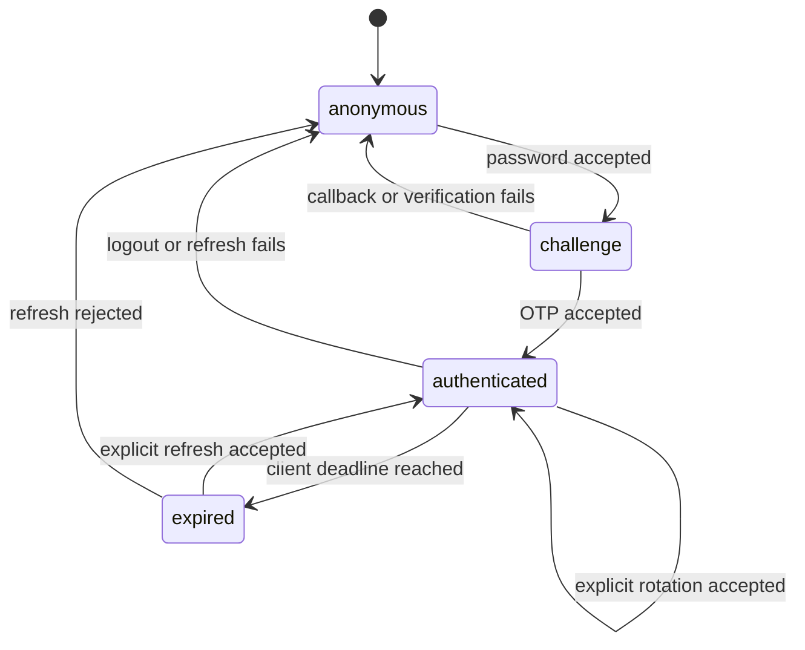

# Phase 5: authentication state, expiry, replay, and failure handling

This guide describes the **owned lab's implemented policy**. DummyJSON token timing,
Booker cookies, and ReqRes API keys retain their earlier semantics; they are not
evidence for this policy. Read [layer communication](phase-5-workflow.md) and
[the scenario map](phase-5-test-plan.md) alongside the source.

## Server state and client state

| Object | State / lifetime | Authoritative check |
| --- | --- | --- |
| User | Member, tenant, password hash, failure count, optional TOTP step | DB role/tenant and password verification |
| Challenge | Unconsumed/consumed, expiry, attempts | DB row plus keyed OTP digest or current TOTP |
| AuthSession | Active/revoked; absolute refresh-family expiry | DB lookup on authenticated requests |
| RefreshToken | Known digest, unused/used | Atomic unused-row claim, with history retained |
| JWT | Signed access claims and short expiry | Pinned signature + manual temporal checks + DB session |
| LabSession | Anonymous/challenge/authenticated/expired | Client token shape and elapsed lifetime; server still decides validity |

`LabSession.authenticate` clears previous state before starting a new login.
Passwords and OTPs are supplied only to the required calls. A callback/shape/HTTP
failure clears state and raises a safe `AuthFlowError`. Tokens have hidden repr and
must be nonempty printable ASCII without control characters. The class belongs to
one test and is not a thread-safe shared session manager.

`headers()` refuses to send an expired access token. This is a local scheduling
check, not signature verification. `refresh()` remains available after access
expiry and is always explicit. An ordinary response 401 does not silently refresh
or replay the request; a test must decide its next action. Logout clears client
memory even when the server logout request fails. In that case server revocation
is **unconfirmed**, and the failure remains visible.

## Password and challenge policy

Registration accepts synthetic `@example.test` addresses and passwords of at
least twelve characters. Strict inputs reject extra role/tenant fields. Each user
receives a fresh server-generated tenant UUID and member role. Admin provisioning
is a test-owned DB seam, never a registration parameter.

Passwords use `pwdlib`'s recommended Argon2 hash. An unknown account still checks a
dummy Argon2 hash and shares the safe invalid-credentials error with a wrong
password. This reduces an obvious timing difference; the suite does not prove
constant-time account behavior or resistance to a sustained guessing campaign.

Three wrong password attempts produce 401; the subsequent call during the
30-second lock returns 429 and Retry-After. A correct login after lock expiry resets
the counter. This is per-account enforcement, not an IP/global rate limiter.

Correct password creates a 120-second challenge and invalidates older pending
challenges for that user. Login returns challenge ID/method/lifetime, never tokens
or code. Email/mock-SMS codes use a random six-digit value. The DB stores HMAC over
challenge ID and code using the signing key, preventing a plain six-digit digest
table from permitting trivial offline guessing. Verification accepts only six
ASCII digits. Wrong valid-format attempts increment the persisted budget; after
three, further verification returns 429 until expiry/new login. At exact expiry,
the challenge is invalid and returns 401.

Challenge consumption and session creation share a transaction. A conditional DB
update can consume only an unused challenge with remaining attempts. Concurrent
login and verification use the same user-first lock order to avoid inverted locks.
See `tests/lab/test_concurrency.py` for the two-request regressions.

## Email, TOTP, and mock SMS

SMTP sends only to synthetic lab addresses. Mailpit captures locally; it does not
forward mail to real recipients. `MailpitCodeReader` checks recipient, exact
challenge-specific subject, body challenge ID, and six-digit body code. It never
takes the latest message from a shared mailbox. Challenge IDs are UUID-validated;
Mailpit v1.31.4 message IDs retain their opaque 22-character ASCII alphanumeric
format, validated before path use. CRLF email text is normalized to LF before
strict body matching. Polling has a bounded configured budget and each HTTP request
has its own timeout; the total can include those request durations.

Polling observes delivery. It does not repeat password/OTP verification or retry a
failed business mutation. SMTP failure after challenge commit invalidates that
challenge, adds `delivery_failed`, and returns 503 without the underlying exception.
There is no delivery retry/outbox; a process crash between commit and send remains
a lab limitation. Tests inject a broken delivery adapter to check the safe failure.

TOTP uses the current 30-second step only (`valid_window=0`). The accepted step must
be newer than the user's persisted `last_totp_step`; replay through a fresh
challenge in the same step is rejected. An injected server clock makes boundaries
deterministic. There is no HTTP time-control endpoint. Advancing the clock in tests
does not change container system time or introduce real waiting.

Enrollment is deliberately simplified: synthetic signup returns the TOTP secret
once and stores it in the database without KMS encryption or enrollment confirmation.
Treat that response as secret-bearing; do not attach it to a defect. SMS uses only
an explicitly injected `CapturedDelivery` adapter. The app container has no SMS
gateway and rejects SMS registration when no adapter exists. No phone number or
real SMS recipient is used.

## Access JWT verification

`JwtPolicy` issues HS256 tokens. Verification pins HS256 independent of the token
header, verifies signature/issuer/audience, and requires `sub`, `sid`, `jti`, `iss`,
`aud`, `iat`, `nbf`, `exp`, and access kind. Identity IDs must be nonempty strings;
timestamps must be integers, excluding booleans.

PyJWT's system-clock temporal validation is disabled specifically because tests
inject the server clock. Equivalent explicit checks require:

- `iat <= now` and `nbf <= now`;
- `now < exp` and `exp > iat`;
- access kind, expected issuer/audience, and the pinned valid signature.

The HTTP tampering test proves a forged signing key is rejected. Unit matrices
check wrong algorithm, missing/incorrect claims, types, future times, and expiry.
Decoded JWT contents are never accepted as authentication evidence without these
checks. Following JWT verification, the DB session must exist, match `sub`, remain
active, and be before its absolute expiry. Current DB user role/tenant drives
authorization; stale token role claims cannot elevate privileges.

## Refresh rotation and logout

Access lifetime is 120 seconds; a session family's absolute lifetime is 900 seconds.
Refresh is an opaque session-prefixed random token with 256-bit random secret. Only
its SHA-256 digest is stored, including used-token history. High-entropy refresh
digests differ from low-entropy OTP storage, which requires a keyed digest.

1. Unknown digest returns 401. A guessed session prefix does not revoke a valid
   family, preventing an easy unauthenticated revocation attack.
2. A known unused token locks its session and is conditionally marked used.
3. Rotation creates a fresh access/refresh pair and records `refresh_rotated`.
4. Reuse of a known used token revokes the family and records
   `refresh_reuse_revoked`. Current and earlier access tokens then fail DB validation.

In a concurrent refresh race, one returns 200 and the reuse returns 401, revoking
the family. The winning response therefore becomes unusable too. Clients must
serialize rotation; the framework intentionally surfaces this race rather than
silently retrying it. Rotation does not extend the family's absolute expiry.
The returned access lifetime is its JWT lifetime; the DB family can expire sooner.
Successful refresh does not separately invalidate a still-unexpired older access
JWT in the same active family. Logout/reuse/absolute expiry invalidate the family.

Logout requires valid access, sets session revocation, and records `logged_out`.
It affects that session family, not every login for the user. An already expired
client must refresh or clear state; this lab does not implement a separate
refresh-token logout endpoint or account-wide logout.

## Graceful failure contract

| Condition | Result | State / evidence |
| --- | --- | --- |
| Invalid password/unknown user | 401 `invalid_credentials` | No access token; existing-user failure audit |
| Password lock | 429 with Retry-After | Client sees lock; no hidden waiting/replay |
| Expired/consumed challenge | 401 `invalid_challenge` | No new session |
| Wrong OTP / exhausted budget | 401 / 429 | Persisted attempts; no code in error |
| SMTP failure | 503 `otp_delivery_unavailable` | Challenge invalidated; safe audit |
| Bad JWT/expired/revoked session | 401 + `WWW-Authenticate: Bearer` | No protected operation |
| Member at admin gate | 403 | No privilege assignment via signup |
| Another user's document | 404 | Both owner and tenant predicates required |
| Strict input failure | Safe 422 | Submitted values removed from error envelope |
| Unexpected application exception | Safe 500 | Correlation ID; investigate private execution evidence |
| Receipt directory unavailable | Original test outcome retained | Redacted report section; no plugin INTERNALERROR |

## Secret lifecycle and boundaries

`scripts/init_lab.py` creates a 0600 key in an ignored 0700 directory, with exclusive
creation and no value output/overwrite. Compose mounts the file as a secret.
Because a bind-mounted 0600 host file cannot be read by UID 10001, the bootstrap
reads it as root, clears supplementary groups, drops GID/UID to 10001, and execs
Uvicorn. CI checks the application's PID 1 UID. Docker exec/healthcheck commands
still inherit the image's root default; this is not a rootless container claim.
Do not dump process environments or `docker inspect` into shared reports.

The private key stays out of Git, Docker context, package archives, and receipts.
The key must persist across app restart for existing JWT/OTP state. Replacing it
invalidates signed access/OTP material but is not a complete session-family key
rotation protocol. Database and Mailpit ports bind to host loopback. Compose's
published DB password is disposable lab configuration, never a production secret.

This lab has no TLS termination, external OIDC provider, password reset, email
ownership verification, full MFA enrollment/recovery, encrypted TOTP storage,
key-ring rotation, retention worker, schema migration system, distributed rate
limiter, or security certification. Expired rows/history remain until the disposable
database is removed. These are extension choices, not completed Phase 5 claims.

## Primary references reviewed on 4 October 2026

- [FastAPI JWT/password tutorial](https://fastapi.tiangolo.com/tutorial/security/oauth2-jwt/)
- [PyJWT API and algorithm/claim rules](https://pyjwt.readthedocs.io/en/stable/api.html)
- [PyOTP replay guidance](https://pyauth.github.io/pyotp/)
- [Mailpit API](https://mailpit.axllent.org/docs/api-v1/)
- [Mailpit v1.31.4 message-ID implementation](https://github.com/axllent/mailpit/blob/v1.31.4/internal/shortuuid/shortuuid.go)
- [SQLAlchemy session basics](https://docs.sqlalchemy.org/en/20/orm/session_basics.html)

These support library usage. The lab's TTLs, statuses, and acceptance rules are
project policy defined by the code and tests, not provider guarantees.
