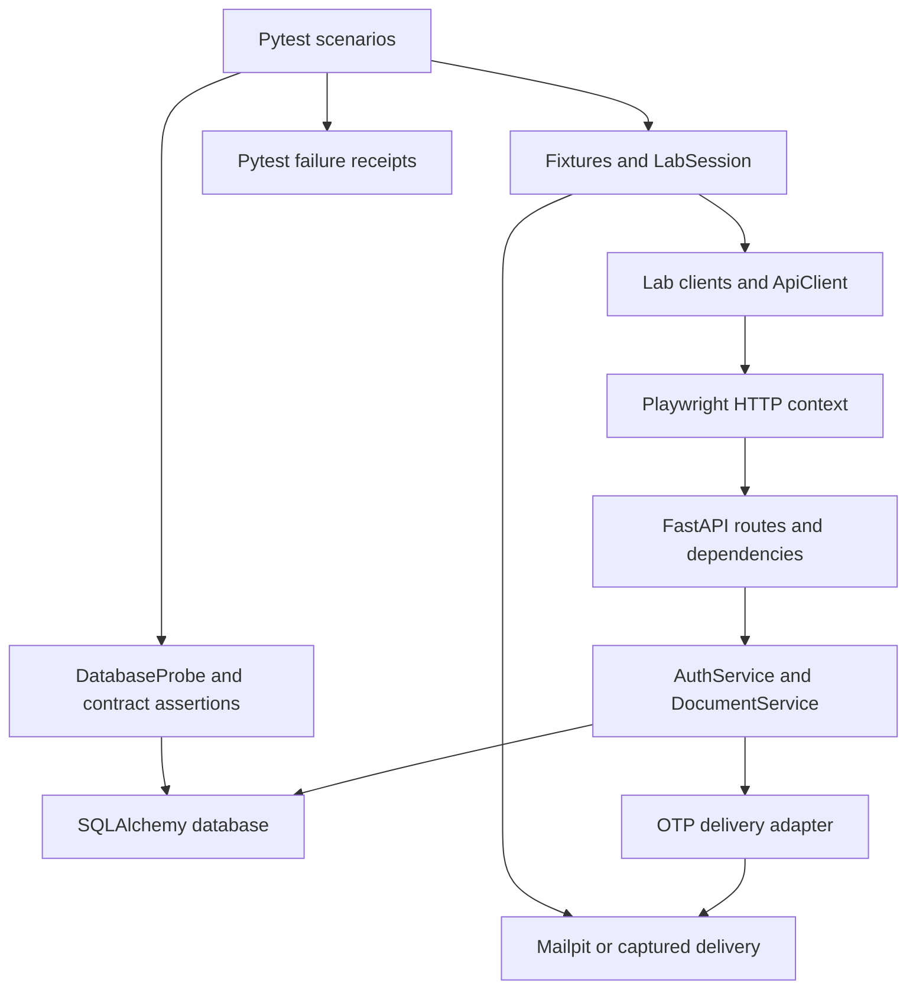

# Phase 5: project workflow and communication between layers

Phase 5 completes the portfolio with an **owned authentication and document lab**.
It combines the former roadmap's owned app, MFA/files, bounded security/property
checks, and parallel reporting into one final milestone. Earlier public adapters
remain independent. Start with [setup](phase-5-walkthrough.md), then read the
[authentication guide](phase-5-auth.md), [test plan](phase-5-test-plan.md), and
[actual validation](validation.md). Implementation is version 0.5.0.

## Two sides of one test

The automation package is the caller. The owned FastAPI package is the system
under test. A real Playwright HTTP request crosses that boundary; tests do not
call service methods to complete a business operation.

Fixtures own resources and inject test seams. API and database checks form separate
observations: a correct response alone does not establish a stored write. The probe
opens a separate SQLAlchemy session and queries returned IDs; it shares the app's
ORM model definitions, so it is not an independently authored database schema oracle.

## Layer map

| Layer / source | Receives | Owns / returns | Communication rule |
| --- | --- | --- | --- |
| `tests/lab/*.py` | Harness, synthetic data | Expected status, identity, bytes, DB relationships | Business assertions stay visible here |
| `tests/lab/conftest.py` | Opt-in flags, Playwright driver | Per-test app, clock, schema, contexts, sessions | Teardown closes resources even on failure |
| `auth/lab_session.py` | Auth client and code callback | In-memory client state and explicit Bearer headers | No global cache or automatic business replay |
| `clients/lab/` | Payload, returned UUID, session | Endpoint path, request shape, raw `APIResponse` | Does not convert 4xx into a success |
| `core/api_client.py` | Method/path, JSON or multipart, headers | Playwright transport; safe method/path/status/timing | Multipart and JSON are mutually exclusive |
| `framework_lab/app.py` | HTTP request, strict schemas | Correlation headers, dependencies, response/error envelope | Composition root wires services and adapters |
| `framework_lab/auth_service.py` | DB session, credentials/challenge, correlation ID | Password/MFA/session/refresh policy | Commits state transitions and audit together |
| `framework_lab/document_service.py` | Authenticated identity, validated upload | Owner-scoped persistence and idempotency | Uses DB uniqueness to settle concurrent creates |
| `framework_lab/security.py` | Key, clock, claims or bytes | JWT/OTP/password/filename policy | Never trusts a token's declared algorithm |
| `framework_lab/models.py` and `database.py` | ORM operations | Tables, constraints, sessions, read probe | Bound parameters; hidden connection parameters |
| `framework_lab/delivery.py` | Synthetic recipient, challenge, code | SMTP email or explicitly injected mock delivery | No public code-reading endpoint |
| `auth/mailpit.py` | Recipient and current challenge | Exact matching six-digit code or safe timeout | Bounded mailbox polling, no sign-in retry |
| `assertions/openapi.py` | App OpenAPI and selected response | Safe JSON Schema validation | Structure checks accompany business assertions |
| `reporting/` | Failed Pytest report metadata | Allowlisted domain receipt | No exception/body/parameter copying |

Client-side paths in this table are relative to `src/api_framework/`. The owned
application lives separately under `src/framework_lab/`. Public DummyJSON,
Booker, and ReqRes clients never import this app or reuse its MFA session.

## The complete journey

1. A fixture creates a fresh SQLite database or PostgreSQL schema, signing key,
   controlled server clock, app factory, and random loopback Uvicorn port.
2. Registration creates a synthetic user and tenant. The server hashes the password
   with Argon2 and assigns member role; public input cannot choose role or tenant.
3. Password login creates a short-lived challenge. It returns no access token or OTP.
4. A callback retrieves the correlated email, generates the current TOTP step, or
   reads the explicitly injected mock SMS delivery. Verification consumes the
   challenge and creates a DB-backed session plus access/opaque refresh tokens.
5. `LabSession` holds those tokens privately. `DocumentsClient` asks it for a
   header for each explicit call. Expired client state requires explicit refresh.
6. Upload validates a small text file and idempotency UUID, commits bytes/metadata
   and audit, and returns the server-generated document ID. A separate GET and
   database probe check persistence; download bytes are compared with SHA-256.
7. Delete checks identity/tenant ownership, commits deletion and audit, returns 204.
   GET 404 and a missing DB row establish deletion in this owned database.
8. Refresh rotates the opaque token. Logout revokes that session and clears client
   memory; reusing its previous access header is rejected by the server.
9. Contexts and server close. The database fixture drops only its own random schema
   or disposes its temporary SQLite engine. No public seed data is involved.

The container smoke performs the same HTTP journey against the **installed app**
in Docker, using real PostgreSQL and SMTP/Mailpit. It does not inject a clock or
read OTPs through an application debug endpoint.

## Patterns, with their concrete purpose

| Pattern | Concrete use | Maintenance benefit |
| --- | --- | --- |
| Composition root | `create_app(settings, engine, clock, delivery)` | Test configuration does not leak into routes |
| Dependency injection | Per-request SQLAlchemy session and authenticated identity | Clear request resource ownership |
| Service layer | Auth/document rules outside route declarations | One place to understand each transition |
| Delivery port and adapters | `OtpDelivery` protocol; SMTP and captured implementations | Real transport and deterministic failures use the same policy |
| Explicit state machine | `LabSession` exposes authenticate/headers/refresh/logout | Failure and expiry behavior can be reasoned about |
| Unit of work | One DB session; policy-specific commit/rollback | State and success audit are committed together |
| Compare and set | Consume challenge/token only while unused | A race cannot issue two successful rotations |
| Database uniqueness | `(owner_id, idempotency_key)` | Independent workers agree on one document |
| Resource-owning fixtures | Schema/server/context teardown in nested `finally` blocks | Failed assertions do not leak worker state |

There is no generic repository hierarchy, dependency-injection container, or
provider abstraction without a concrete caller. Tests use direct, readable client
methods. Database transactions end before SMTP; sending email and committing a
challenge are **not a distributed transaction**. Delivery failure invalidates the
challenge and records a safe error. There is no transactional outbox in this lab.

## Concurrency boundaries

PostgreSQL login and verification lock **user first, challenge second**. Verification
refreshes the previously loaded challenge after acquiring locks. A conditional
update also requires an unconsumed challenge and remaining attempts; TOTP requires
a strictly newer persisted step. Refresh locks the session before claiming a known
unused refresh-token row. Duplicate document insert rolls back and reads the
winner, checking filename/MIME/checksum before returning an idempotent 200.

SQLite does not implement PostgreSQL row locking. Local race checks exercise CAS
and constraints; PostgreSQL CI checks the real row-lock path separately. A passing
two-request race is a regression signal, not exhaustive interleaving or load proof.

Each xdist worker owns its Playwright process and per-test DB/schema/port/email.
The special race tests use a separate Playwright driver/context **inside each
thread**. They never share a synchronous Playwright driver across threads.

## Errors, audit, and defects

Application policy errors have a short error code and server-generated UUID
correlation ID, matching `X-Correlation-ID`. Responses disable caching. Auth 401s
include a Bearer challenge; lockout 429s include Retry-After. Validation errors
discard submitted values; unexpected failures return a safe 500 envelope.

Persisted audit stores user ID, event name, and correlation ID. It is a small
application audit trail, not an immutable external security log. The member/admin
endpoint demonstrates a role gate; it returns role/tenant information rather than
an exported audit stream. Passwords, OTPs, refresh values, and document content do
not enter audit rows.

The Pytest plugin records **test failure evidence**, not an automatically proven
application defect. Setup, call, and teardown are distinct. Route the receipt to
the appropriate [domain triage guide](defect-management.md), reproduce the smallest
case, and separate observations from hypotheses before writing RCA.

## Extension workflow

Read the repo [testing skill](../.agents/skills/api-test-strategy/SKILL.md), identify
one risk, add one service/client operation with its scenario, and update the plan.
Keep known public contract evidence separate from owned app policy. Run focused
checks, full local quality, package/wheel checks, and the owned CI job before
claiming PostgreSQL/SMTP/container compatibility. Record commands and outcomes in
[validation.md](validation.md), including failures and pending evidence.
